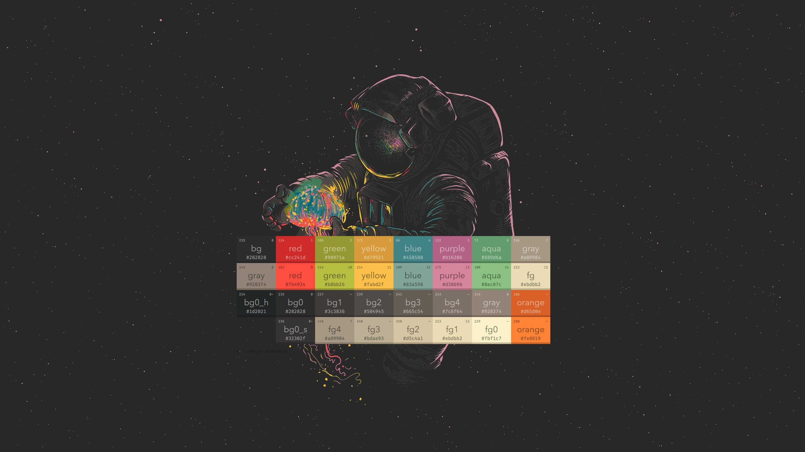
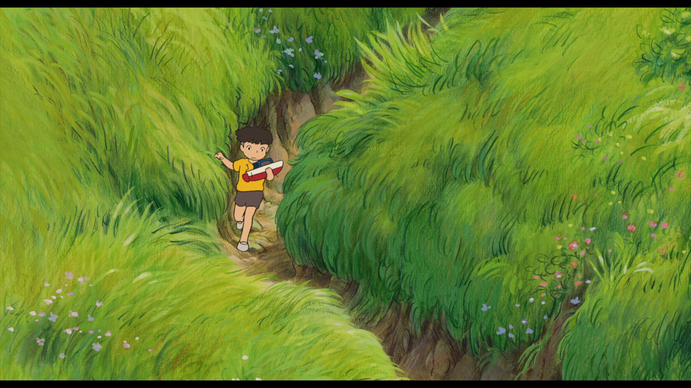
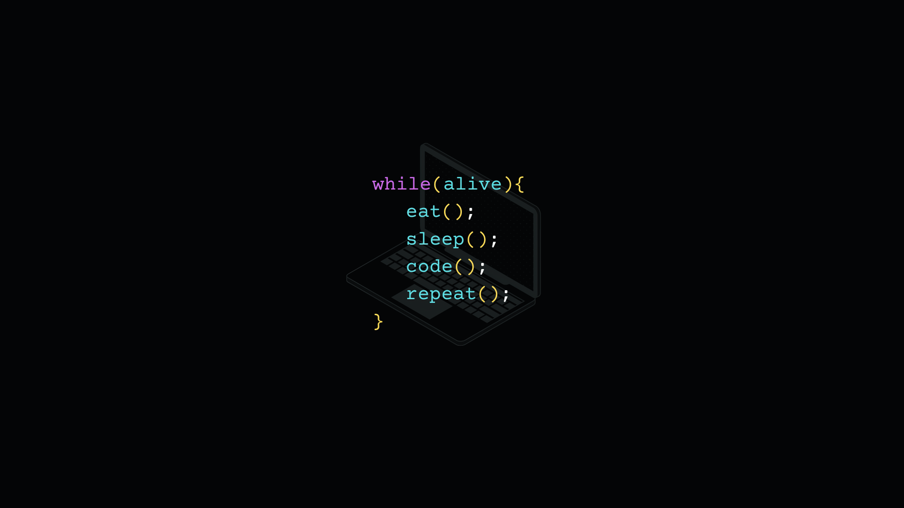

# Dotfiles - Arch Linux

Configurações para o ambiente Arch Linux com Hyprland e o kernel CachyOS (BORE/LTO).

## Stack e Ferramentas

| Componente | Ferramenta |
| :--- | :--- |
| **Sistema Operacional** | Arch Linux |
| **Kernel** | CachyOS (BORE / LTO) |
| **Gerenciador de Janelas** | Hyprland (Caelestia) |
| **Terminal** | Kitty |
| **Shell** | Fish Shell |
| **Editor de Texto** | Neovim |
| **Barra de Status** | Waybar |
| **Lançador de Aplicativos** | Rofi |
| **Informações do Sistema** | Fastfetch |
| **Monitor de Recursos** | Btop |

## Modos de Instalação e Uso

### Opção 1: Apenas Aplicar Configurações e Customizações
Para quem já possui o ambiente configurado e deseja apenas clonar e aplicar os dotfiles e utilitários Python:

```bash
git clone [https://github.com/LourenzoARC/dotfiles.git](https://github.com/LourenzoARC/dotfiles.git) ~/dotfiles && cd ~/dotfiles && mkdir -p ~/.config && cp -rf config/* ~/.config/ && sudo cp -rf config/caelestia/utils/* /usr/lib/python3.14/site-packages/caelestia/utils/
```

### Opção 2: Instalação Completa do Zero 
Para clonar e executar a instalação completa automatizada (kernel CachyOS, pacotes, configs e utilitários):

```bash
git clone [https://github.com/LourenzoARC/dotfiles.git](https://github.com/LourenzoARC/dotfiles.git) ~/dotfiles && cd ~/dotfiles && ./install.sh
```

## Estrutura do Repositório

- `config/hypr/`: Configurações e gerenciamento do Hyprland.
- `config/fish/`: Configurações e plugins do Fish Shell.
- `config/nvim/`: Arquivos de configuração do Neovim.
- `config/kitty/`: Configurações do terminal Kitty.
- `config/waybar/`: Layout e estilos da barra de status.
- `config/rofi/`: Configurações do menu de aplicativos.
- `config/fastfetch/`: Perfil do sistema.
- `config/btop/`: Tema e configurações do monitor de recursos.
- `config/caelestia/utils/`: Utilitários e customizações em Python.
- `install.sh`: Script de automação e implantação completa.
## 🖼️ Wallpaper Catalog

Clique em qualquer miniatura para abrir em tamanho real e baixar:

<!-- WALLPAPER_CATALOG_START -->
<div align="center">

  <a href="wallpapers/static/1002335410.jpg" target="_blank">
    
  </a>
  <a href="wallpapers/static/1059447.jpg" target="_blank">
    
  </a>
  <a href="wallpapers/static/1095258.jpg" target="_blank">
    
  </a>
  <a href="wallpapers/static/123.jpg" target="_blank">
    
  </a>
  <a href="wallpapers/static/1287023.jpg" target="_blank">
    
  </a>
  <a href="wallpapers/static/1293921.png" target="_blank">
    
  </a>
  <a href="wallpapers/static/1356810.jpeg" target="_blank">
    
  </a>
  <a href="wallpapers/static/1369866.png" target="_blank">
    
  </a>
  <a href="wallpapers/static/1405791.jpg" target="_blank">
    
  </a>
  <a href="wallpapers/static/1405994.png" target="_blank">
    
  </a>
  <a href="wallpapers/static/1406260.jpg" target="_blank">
    
  </a>
  <a href="wallpapers/static/26ef46a3f94f09ff5ff2837e75bb1d16.jpg" target="_blank">
    
  </a>
  <a href="wallpapers/static/335857.jpg" target="_blank">
    
  </a>
  <a href="wallpapers/static/420274.jpg" target="_blank">
    
  </a>
  <a href="wallpapers/static/420275.jpg" target="_blank">
    
  </a>
  <a href="wallpapers/static/420278.jpg" target="_blank">
    
  </a>
  <a href="wallpapers/static/420281.jpg" target="_blank">
    
  </a>
  <a href="wallpapers/static/456baa72970c272169f0b4a5bbb152fd.jpg" target="_blank">
    
  </a>
  <a href="wallpapers/static/690686.png" target="_blank">
    
  </a>
  <a href="wallpapers/static/723775.png" target="_blank">
    
  </a>
  <a href="wallpapers/static/732891.png" target="_blank">
    
  </a>
  <a href="wallpapers/static/732939.png" target="_blank">
    
  </a>
  <a href="wallpapers/static/781636.png" target="_blank">
    
  </a>
  <a href="wallpapers/static/961688.png" target="_blank">
    
  </a>
  <a href="wallpapers/static/991984.png" target="_blank">
    
  </a>
  <a href="wallpapers/static/994928.jpg" target="_blank">
    
  </a>
  <a href="wallpapers/static/ByDiscord.ggWallpapers.png" target="_blank">
    
  </a>
  <a href="wallpapers/static/By_discord.ggWallpapers.png" target="_blank">
    
  </a>
  <a href="wallpapers/static/Design sem nome.png" target="_blank">
    
  </a>
  <a href="wallpapers/static/WhatsApp Image 2026-03-02 at 12.38.30.jpeg" target="_blank">
    
  </a>
  <a href="wallpapers/static/WhatsApp Image 2026-08-08 at 11.50.43.jpeg" target="_blank">
    
  </a>
  <a href="wallpapers/static/a4801e8a7696debe1b70ba2beaa5a03b.0000000.jpg" target="_blank">
    
  </a>
  <a href="wallpapers/static/a5cb1eae54f9b659d511a341b555f6a8.jpg" target="_blank">
    
  </a>
  <a href="wallpapers/static/ababa (1) (Cópia).jpg" target="_blank">
    
  </a>
  <a href="wallpapers/static/anime_girl.png" target="_blank">
    
  </a>
  <a href="wallpapers/static/blue-girl-among-flowers.jpg" target="_blank">
    
  </a>
  <a href="wallpapers/static/brave.png" target="_blank">
    
  </a>
  <a href="wallpapers/static/cbd0145b-9ee0-44eb-ae0e-5814db3681c9_upscaled.png" target="_blank">
    
  </a>
  <a href="wallpapers/static/dmkse09-b739a814-5811-4a93-a900-7d61597bc129(1)(1) (1).png" target="_blank">
    
  </a>
  <a href="wallpapers/static/eat-sleep-code-1920x1080-16019.png" target="_blank">
    
  </a>
  <a href="wallpapers/static/eye.png" target="_blank">
    
  </a>
  <a href="wallpapers/static/image.png" target="_blank">
    
  </a>
  <a href="wallpapers/static/image0 (3).jpg" target="_blank">
    
  </a>
  <a href="wallpapers/static/justice.png" target="_blank">
    
  </a>
  <a href="wallpapers/static/my-neighbor-totoro-sunflowers.png" target="_blank">
    
  </a>
  <a href="wallpapers/static/olorebah.png" target="_blank">
    
  </a>
  <a href="wallpapers/static/oteste1.png" target="_blank">
    
  </a>
  <a href="wallpapers/static/park.png" target="_blank">
    
  </a>
  <a href="wallpapers/static/person.jpg" target="_blank">
    
  </a>
  <a href="wallpapers/static/plane.png" target="_blank">
    
  </a>
  <a href="wallpapers/static/putz[.png" target="_blank">
    
  </a>
  <a href="wallpapers/static/space_girl.webp" target="_blank">
    
  </a>
  <a href="wallpapers/static/tadashib.jpeg" target="_blank">
    
  </a>
  <a href="wallpapers/static/tadashibd.jpeg" target="_blank">
    
  </a>
  <a href="wallpapers/static/thumb-1920-841345.png" target="_blank">
    
  </a>
  <a href="wallpapers/static/train_stop_underwater.jpg" target="_blank">
    
  </a>
  <a href="wallpapers/static/wp1856964.jpg" target="_blank">
    
  </a>
  <a href="wallpapers/static/wp1856975.jpg" target="_blank">
    
  </a>
  <a href="wallpapers/static/wp1856984.jpg" target="_blank">
    
  </a>
  <a href="wallpapers/static/wp1856985.jpg" target="_blank">
    
  </a>
  <a href="wallpapers/static/wp1856993.jpg" target="_blank">
    
  </a>
  <a href="wallpapers/static/wp1856995.jpg" target="_blank">
    
  </a>
  <a href="wallpapers/static/wp1857007.png" target="_blank">
    
  </a>
  <a href="wallpapers/static/wp7594251-lie-to-me-wallpapers.jpg" target="_blank">
    
  </a>
  <a href="wallpapers/static/wp7594381-lie-to-me-wallpapers.jpg" target="_blank">
    
  </a>

</div>
<!-- WALLPAPER_CATALOG_END -->